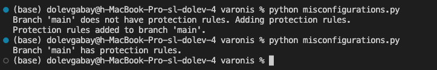
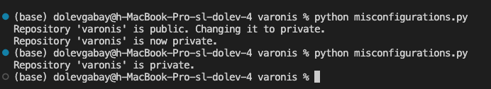
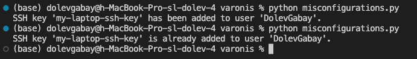

# Branch Protection Rules

## Best Practice Recommendation
Set up branch protection rules to ensure that critical branches in your repository are safeguarded against unauthorized or accidental changes.

## Explanation of the Configuration
Branch protection rules are settings that restrict who can make changes to specific branches in your repository. They can require code reviews, status checks, and other safeguards before changes are merged.

## Risks of Not Following the Best Practice
Without branch protection rules, anyone with write access can directly modify critical branches, potentially introducing vulnerabilities, bugs, or malicious code. This can compromise the stability and security of your project.

## Steps to Fix the Configuration Manually
1. **Go to Your Repository Settings:**
    - Open GitHub and navigate to the repository you want to secure.
    - Click on "Settings."
2. **Set Up Branch Protection Rules:**
    - Click on "Branches" in the left-hand menu.
    - Under "Branch protection rules," click "Add rule".
    - Specify the branch name (e.g., `main` or `master`) and configure the desired protection settings, such as requiring pull request reviews and status checks.
    - Click "Create".

## Impact on Working with GitHub
Implementing branch protection rules may slow down the integration of changes slightly because it requires additional reviews and checks. However, it significantly improves the overall quality and security of your codebase.

## Related MITRE ATT&CK Technique
**MITRE ATT&CK Technique: T1078 - Valid Accounts**
- **Explanation:** This technique involves using valid accounts to gain unauthorized access. Without branch protection, compromised accounts can make changes to critical branches without detection.
- **How It Relates:** Branch protection rules add an extra layer of defense, ensuring that even valid accounts cannot make malicious or unchecked changes.

## Categories
1. **Configuration Management**
    - Branch protection rules are part of configuration management, ensuring that only reviewed and approved changes are merged into critical branches. This helps maintain a stable and secure codebase.

2. **System and Information Integrity**
    - Branch protection rules help maintain the integrity of the codebase by enforcing reviews and preventing unauthorized or accidental changes to critical branches.

## Code Example for Misconfiguration: Lack of Branch Protection Rules
The function `check_and_fix_repo_branch_protection` checks whether the repository has protection rules. If not, it adds some rules.

## Code Example for Misconfiguration: Repository Visibility Set to Public
The function `check_and_fix_repo_visibility` checks whether the repository is private. If it is not private, the function changes its visibility to private.

## Code Example for Misconfiguration: Missing SSH Key for Secure Access
The function `check_and_add_ssh_key` checks whether the user has SSH key. If it is not it adds one.

# Framework for Monitoring and Fixing Misconfigurations

## Detailed Description

To expand the scripts into a comprehensive framework for monitoring and fixing misconfigurations across multiple services (IaaS, SaaS, PaaS), the following approach can be adopted:

1. **Centralized Management**: Implement a centralized system to manage configurations and monitor services across different platforms.
2. **Modular Architecture**: Develop modules for each service type (IaaS, SaaS, PaaS) to handle service-specific configurations and misconfigurations.
3. **Automated Detection and Remediation**: Automate the detection of misconfigurations and provide automated or semi-automated fixing actions.
4. **Logging and Reporting**: Implement logging and reporting mechanisms to track configuration changes, detected misconfigurations, and remediation actions.
5. **Security**: Ensure that the framework uses security best practices.

## Components of the System

### 1. Services:
- **Configuration Management**: Centralized management of configurations across multiple services, ensuring consistency and compliance.
- **Misconfiguration Detection**: Automated detection of misconfigurations using predefined rules and patterns.
- **Remediation**: Automated or semi-automated remediation actions to fix detected misconfigurations.
- **Logging and Reporting**: Comprehensive logging and reporting of configuration changes, detected issues, and remediation actions.
- **Alerting**: Real-time alerting mechanisms to notify administrators of critical misconfigurations or system failures.

### 2. Data Structures:
- **Configuration Objects**: Represent configurations and their states for different services.
- **Misconfiguration Records**: Store detected misconfigurations with details such as type, severity, and remediation steps.
- **Audit Logs**: Keep a record of all configuration changes and actions taken by the framework.

### 3. Databases:
- **Configuration Database**: Stores current configurations and states of monitored services.
- **Misconfiguration Database**: Logs detected misconfigurations and their remediation status.
- **Audit Database**: Tracks all actions performed by the framework for auditing and compliance purposes.

## Mechanisms for Initiating the System and Monitoring Performance

### 1. Initiating the System:
- **Initialization**: Load initial configurations and set up connections to monitored services.
- **Service Discovery**: Identify and register services to be monitored based on predefined criteria.
- **Configuration Sync**: Sync initial configurations from services to the configuration database.

### 2. Monitoring Performance:
- **Scheduled Scans**: Perform regular scans of service configurations to detect misconfigurations.
- **Real-time Monitoring**: Use webhooks, event listeners, or service-specific APIs to detect changes in real-time.
- **Performance Metrics**: Track metrics such as the number of detected misconfigurations, fixes success rate, and time taken for fix.
- **Alerting**: Implement alerting mechanisms to notify administrators of critical misconfigurations or failures in the system.

## Code Structure, Usage, and Other Considerations

### 1. Code Structure:
- **Modules**:
  - **Service Modules**: Separate modules for handling configurations of different services (e.g., AWS, GitHub).
  - **Detection Module**: Logic for detecting misconfigurations based on predefined rules.
  - **Remediation Module**: Logic for fixing detected misconfigurations.
  - **Logging and Reporting Module**: Functions for logging actions and generating reports.
- **Configuration Files**: YAML or JSON files to define configurations, rules, and settings.
- **Utilities**: Helper functions for tasks such as connecting to services, reading/writing data, and handling errors.

### 2. Usage:
The user needs an interface to use the framework. It can be done in several ways:
- **Command-line Interface (CLI)**.
- **Dashboard**.
- **API**.

### 3. Other Considerations:
- **Scalability**: Ensure the framework can scale to handle multiple services and large volumes of configurations.
- **Security**: Implement strong authentication and authorization mechanisms to protect access to the framework.
- **Extensibility**: Design the framework to be easily extensible with new service modules and detection rules.
- **Documentation**: Provide comprehensive documentation for users and developers, including setup instructions, usage guides, and API references.

## Summary
This framework is designed to automatically detect and fix misconfigurations across different services. By using configuration databases, audit logs, and performance monitoring, it helps manage service configurations effectively while meeting security and compliance standards.
