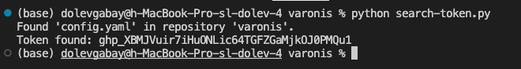

## Setup
- pip install PyGithub
- pip install pyyaml
- python misconfigurations.py

# GitHub Repository Misconfigurations Categories
- Below are five specific configurations that can have security impacts on users or repositories:

## Misconfiguration: Repository Visibility Set to Public

- **Access Control**
  - Public repositories allow anyone to access the code, potentially exposing sensitive information or intellectual property. Proper access control ensures only authorized individuals can access the repository.

- **System and Information Integrity**
  - Making repositories private prevents unauthorized access and potential tampering with data, maintaining the system's integrity.

## Misconfiguration: Lack of Branch Protection Rules

- **Configuration Management**
  - Branch protection rules ensure that only reviewed and approved changes are merged into critical branches, maintaining a stable and secure codebase.

- **System and Information Integrity**
  - These rules enforce reviews, preventing unauthorized or accidental changes to critical branches and maintaining codebase integrity.

## Misconfiguration: Default Permissions for Outside Collaborators

- **Access Control**
  - Granting outside collaborators more permissions than necessary can lead to unauthorized changes or data breaches. Proper access control ensures only authorized users have appropriate levels of access.

## Misconfiguration: Unrestricted GitHub Actions Workflows

- **System and Communications Protection**
  - Unrestricted GitHub Actions workflows can execute arbitrary code, potentially compromising the system. Restrictions are necessary to maintain system security.

## Misconfiguration: Missing SSH Key for Secure Access

### Categories:
- **Identification and Authentication**
  - SSH keys are a secure method for authenticating users. Ensuring users have SSH keys enhances the identification and authentication process, making it more secure.

# Branch Protection Rules

## Best Practice Recommendation: Branch Protection Rules

Setting up branch protection rules is essential to maintain the integrity and stability of critical branches in your repository. Here are some practical best practices:

### 1. Require Pull Request Reviews
- **Require Approval from Reviewers**: Ensure that every pull request (PR) to the protected branch is reviewed and approved by at least one or two qualified reviewers.
- **Enforce Code Owner Reviews**: If you have code owners specified, their approval should be mandatory.
- **Diverse Reviewers**: Encourage reviews from different team members to get varied perspectives and catch more potential issues.

## 2. Enforce Linear History
- **No Merge Commits**: Enforce a linear commit history by preventing merge commits. This ensures a cleaner and more understandable project history.

## 3. Restrict Pushes
- **Restrict Who Can Push to the Branch**: Limit push access to the branch to only those who have the necessary permissions. Typically, only maintainers or senior developers should have direct push access.

## 4. Lock the Branch
- **Lock the Branch**: Prevent any direct commits to the branch by locking it. All changes must go through the pull request process.

Implementing these best practices will help safeguard critical branches from unauthorized or accidental changes, ensuring the stability and security of a project.

## Explanation of the Configuration
Branch protection rules are settings that restrict who can make changes to specific branches in your repository. They can require code reviews, status checks, and other safeguards before changes are merged.

## Risks of Not Following the Best Practice
Without branch protection rules, anyone with write access can directly modify critical branches, potentially introducing vulnerabilities, bugs, or malicious code. This can compromise the stability and security of your project.

## Steps to Fix the Configuration Manually
1. **Go to Your Repository Settings:**
    - Open GitHub and navigate to the repository you want to secure.
    - Click on "Settings."
2. **Set Up Branch Protection Rules:**
    - Click on "Branches" in the left-hand menu.
    - Under "Branch protection rules," click "Add rule".
    - Specify the branch name (e.g., `main` or `master`) and configure the desired protection settings, such as requiring pull request reviews and status checks.
    - Click "Create".

## Impact on Working with GitHub
Implementing branch protection rules may slow down the integration of changes slightly because it requires additional reviews and checks. However, it significantly improves the overall quality and security of your codebase.

## Related MITRE ATT&CK Technique
**MITRE ATT&CK Technique: T1078 - Valid Accounts**
- **Explanation:** This technique involves using valid accounts to gain unauthorized access. Without branch protection, compromised accounts can make changes to critical branches without detection.
- **How It Relates:** Branch protection rules add an extra layer of defense, ensuring that even valid accounts cannot make malicious or unchecked changes.

## Categories
1. **Configuration Management**
    - Branch protection rules are part of configuration management, ensuring that only reviewed and approved changes are merged into critical branches. This helps maintain a stable and secure codebase.

2. **System and Information Integrity**
    - Branch protection rules help maintain the integrity of the codebase by enforcing reviews and preventing unauthorized or accidental changes to critical branches.

## Output Example for Misconfiguration: Lack of Branch Protection Rules
The function `check_and_fix_repo_branch_protection` checks whether the repository has protection rules. If not, it adds some rules.

## Output Example for Misconfiguration: Repository Visibility Set to Public
The function `check_and_fix_repo_visibility` checks whether the repository is private. If it is not private, the function changes its visibility to private.

## Output Example for Misconfiguration: Missing SSH Key for Secure Access
The function `check_and_add_ssh_key` checks whether the user has SSH key. If it is not it adds one.

# Misconfigurations Infrastructure Framework

## A. Detailed Description

### Expanding Scripts into a Comprehensive Framework

To expand scripts into a framework for monitoring and fixing misconfigurations across multiple services (IaaS, SaaS, PaaS), we need to adopt a structured and scalable approach. The framework will involve centralized management, modular architecture, automated detection and remediation, logging and reporting mechanisms, and strong security practices.

### Key Aspects of the Framework:

1. **Modular Architecture**: 
   - Develop specific modules for each type of service (IaaS, SaaS, PaaS). Each module will handle configurations and misconfigurations specific to its service type.

2. **Automated Detection and Remediation**: 
   - Automate the process of detecting misconfigurations and provide options for automated or semi-automated remediation actions.

3. **Logging and Reporting**: 
   - Establish logging and reporting mechanisms to track all configuration changes, detected misconfigurations, and actions taken for remediation.

4. **Security**: 
   - Ensure the framework uses security best practices, including strong authentication and authorization mechanisms to safeguard access.

## B. Components of the System

### 1. Services:
- **Configuration Management**: Centralized management of configurations across multiple services, ensuring consistency and compliance.
- **Misconfiguration Detection**: Automated detection of misconfigurations using predefined rules and patterns.
- **Remediation**: Automated or semi-automated remediation actions to fix detected misconfigurations.
- **Logging and Reporting**: Comprehensive logging and reporting of configuration changes, detected issues, and remediation actions.
- **Alerting**: Real-time alerting mechanisms to notify administrators of critical misconfigurations or system failures.

### 2. Data Structures:
- **Configuration Objects**: These objects represent the configurations and their states for different services. They are the blueprint of the desired configurations for each service.
  
- **Misconfiguration Records**: These records store information about detected misconfigurations, including details such as type, severity, detection time, and recommended remediation steps.

- **Audit Logs**: Logs that keep a detailed record of all configuration changes and actions performed by the framework. This includes user actions, automated changes, and remediation steps.

### 3. Databases:
- **Configuration Database**: This database stores the current configurations and states of all monitored services. It acts as the central repository for the desired state of all configurations. This can be implemented as a table within a unified database or as a separate database if higher performance and scalability are needed.

- **Misconfiguration Database**: A dedicated database or table for logging all detected misconfigurations along with their current remediation status. It helps in tracking and managing the health of all monitored services. Same as above, this can be part of a unified database or a separate database based on performance requirements.

- **Audit Database**: This database keeps track of all actions performed by the framework. It is essential for auditing, compliance, and tracking changes over time. Due to the high volume of write operations, it is recommended to use a database optimized for high write performance, such as InfluxDB or Cassandra. This can be a separate database optimized for logging.

## C. Mechanisms for Initiating the System and Monitoring Performance

### 1. Initiating the System:
- **Initialization**: 
  - Load the initial configurations and set up connections to all services that need to be monitored.
  - Validate the connections and ensure that all required permissions and access controls are in place.

- **Service Discovery**: 
  - Automatically discover and register services to be monitored based on predefined criteria and configuration settings.

- **Configuration Sync**: 
  - Sync initial configurations from the services to the configuration database. This ensures that the framework has the latest state of all configurations.

### 2. Monitoring Performance:
- **Scheduled Scans**: 
  - Perform regular, scheduled scans of service configurations to detect any misconfigurations. The frequency of scans can be configured based on the criticality of the services.

- **Real-time Monitoring**: 
  - Use webhooks, event listeners, or service-specific APIs to detect changes in real-time. This helps in immediately identifying and responding to any misconfigurations.

- **Performance Metrics**: 
  - Track and analyze key performance metrics such as the number of detected misconfigurations, the success rate of fixes, and the average time taken to remediate issues.

- **Alerting**: 
  - Implement alerting mechanisms to notify administrators of critical misconfigurations or failures in the system. Alerts can be sent via email, SMS, or integrated with other monitoring tools.

## D. Code Structure, Usage, and Other Considerations

### 1. Code Structure:
- **Modules**:
  - **Service Modules**: Separate modules handle configurations and misconfigurations for different services (e.g., AWSModule, GitHubModule). These modules exemplify polymorphism, as each one implements a common interface or base class, allowing them to be used interchangeably. This design enables the system to manage various services uniformly, calling the same methods (e.g., check_configuration, fix_misconfiguration) on any service module without needing to know the specifics of each service.
  - **Detection Module**: Contains logic for detecting misconfigurations based on predefined rules and patterns.
  - **Remediation Module**: Contains logic for fixing detected misconfigurations, either automatically or with user approval.
  - **Logging and Reporting Module**: Functions for logging all actions and generating detailed reports on system performance and issues detected.

- **Configuration Files**: Use YAML or JSON files to define configurations, rules, and settings. These files will be read by the framework to apply configurations and detect misconfigurations.

- **Utilities**: Helper functions and utilities for tasks such as connecting to services, reading/writing data, handling errors, and performing common operations.

### 2. Usage:
The user needs an interface to use the framework. It can be done in several ways:

- **Command-line Interface (CLI)**: 
  - Provide a CLI for users to interact with the framework. The CLI will allow users to initiate scans, view logs, and manage configurations.

- **API**: 
  - Expose APIs for integration with other tools and services. The APIs will allow external systems to interact with the framework for monitoring and remediation tasks.

### 3. Other Considerations:
- **Scalability**: 
  - Ensure the framework can scale to handle multiple services and large volumes of configurations. Use distributed processing and efficient data handling techniques to achieve scalability.

- **Extensibility**: 
  - Design the framework to be easily extensible. New service modules and detection rules should be easy to add without requiring major changes to the existing codebase.

- **Documentation**: 
  - Provide comprehensive documentation for users and developers. Include setup instructions, usage guides, API references, and examples to help users get started and effectively use the framework.

## Summary
This framework should be design to automatically detect and fix misconfigurations across different services (IaaS, SaaS, PaaS). By utilizing centralized management, modular architecture, automated detection and remediation, logging, and performance monitoring, the framework helps manage service configurations effectively while meeting security standards.

# Bonus
Running the script search-token.py allows you to search for private tokens in any given public repository. This exposes the private key, putting it at risk.

